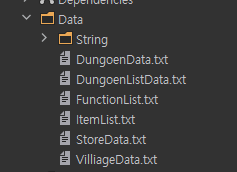
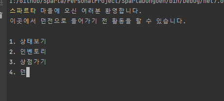

# SpartaDungoen

## 구현 방향
- Data Driven System을 최대한 반영해서 프로그래밍 하는 것

- 여러 환경의 언어를 지원하는 것을 가정, string 파일을 기준으로 출력하도록 설계
- 각 기능을 추가하는 데 어려움이 없도록 제작

## 구현 구조 및 결과

- 데이터 초기화
  - 아이템, 던전리스트, 상점리스트 등 지정 되어있는 데이터에 대해 외부에서 관리할 수 있도록 구성
    - 
     
 

  - 외부데이터를 읽어오기 위한 시스템 구성
    - DataReader를 부모로 하위클래스와 데이터 클래스 
    - DataReader에서 데이터를 읽어서 분리
    - 하위 클래스에서 각기 맞는 class로 가공하여 저장
    -  
    - Container 클래스들은 default 데이터를 보관 및 제공역할을 담당

 

  - 전체적인 초기화
    - ResourceManager에서 각 Container에 대한 초기화를 담당.

 

- 입력부
  - 해당 화면의 기능의 수에 따라 입력의 제한을 두고 사용
  - 입력 관련 클래스
    - InputMemory 
      - 다른 클래스, 함수에서 이전에 입력했던 내용을 읽어내기 위해서 사용
    - Program.cs 내 TryGetKey 부분

 

- 기능동작부
  - Command
    - 기능을 하나의 클래스로 일반화

    - 관련 클래스
      - Command와 하부 자식 클래스

      - 
    - 상태보기, 마을가기, 던전가기, 장착, 구매 등 모든 행위에 대해 구현

 

- 출력부
    - 화면 출력을 Top, Info, Select, End 네 부분으로 나누어 관리
    - 화면 출력에 필요한 내용 기능 동작부에서 각 부분에 string을 채워넣고,
    - 색채우기도 가능
    - 출력 부에서는 한글자씩 표기
    - 관련 이미지
    - 
    - 이때 아무 입력이나 누르면 전부 출력.

## 반성
- Command
  - 화면 출력부를 분리 한것까지는 좋았으나 실질적으로 가공을 담당하는 Command 부분에서 이를 분리하지 않고, 하나의 메소드로 해결.
  - 중복 실행부분이 늘어남에 따라서, 코드량 증가, 유지보수의 어려움이 증대됨
  - 화면 출력부의 분리한것과 맞춰서 Command도 4개의 메소드로 분리, 
  - 필요에 따라 해당 메소드를 오버라이딩 하는 방식이었다면 좀 더 좋았을 부분
- DataReader
  - 데이터를 얻어오는 부분에 대한 구조부족
  - 제각기의 메소드의 사용으로 구체화에는 좋았지만, 유지보수의 어려움이 증대됨.
  - DataReader에서 모든것을 총괄 할 수 있도록 구성했다면 더 좋았을 부분

 